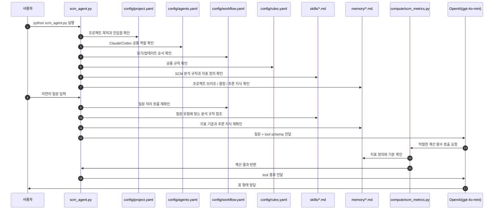
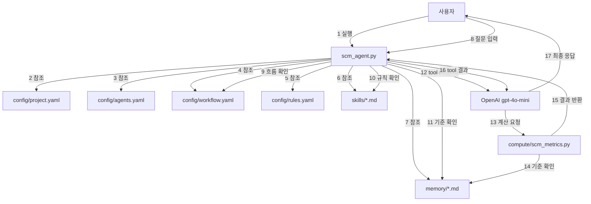

# 공유 AI 메모리 시스템

이 저장소는 Claude와 Codex가 함께 사용하는 공유 메모리 작업공간입니다.

## 이 저장소의 목적

이 저장소는 프로젝트 구조, 공통 지침, 기억해야 할 내용을 문서로 남겨서 다음 세션에서도 같은 맥락을 유지하게 합니다.

## SCM 에이전트

이 저장소에는 `data/` 안의 CSV를 읽어서 주간 지표를 로컬에서 계산하고, `gpt-4o-mini`로 질문을 해석하는 SCM 분석 에이전트도 들어 있습니다.

설계 구조를 개발자 관점에서 보고 싶으면 [`docs/scm-agent-architecture.md`](C:\pyproject\ai\docs\scm-agent-architecture.md)를 읽으면 됩니다.

## 저장소 구조

- `config/project.yaml` - 최상위 진입점
- `config/agents.yaml` - Claude와 Codex의 공통 흐름 매핑
- `config/workflow.yaml` - 읽기/업데이트 순서
- `config/rules.yaml` - 공통 규칙
- `skills/` - 재사용 가능한 작업 규칙
- `memory/` - 영구 기억 저장소
- `compute/` - CSV 계산 로직
- `docs/` - 개발자용 설계 문서
- `AGENTS.md` - Codex용 공통 운영 지침
- `CLAUDE.md` - Claude용 지침
- `.claude/` - Claude 전용 지원 파일
- `.codex/` - Codex 전용 지원 파일
- `.vscode/` - 편집기 설정

## 작업 흐름

1. `config/project.yaml`를 먼저 읽습니다.
2. `config/agents.yaml`에서 Claude와 Codex가 어떻게 연결되는지 봅니다.
3. `config/workflow.yaml`에서 읽기 순서를 확인합니다.
4. `config/rules.yaml`에서 공통 규칙을 확인합니다.
5. 관련된 `skills/*.md`를 읽습니다.
6. `memory/00-index.md`에서 필요한 메모리 파일을 찾습니다.
7. `memory/01-project-brief.md`에서 프로젝트 목적을 확인합니다.
8. `memory/02-decisions.md`를 보고 구조나 동작을 바꿀 때 참고합니다.
9. `memory/03-active-context.md`에서 현재 작업 상태를 봅니다.
10. 작업이 끝나면 중요한 내용은 메모리에 다시 기록합니다.

### 시퀀스 다이어그램



## SCM 에이전트 실행

```bash
python scm_agent.py
```

인자를 주지 않으면 대화형 프롬프트가 열립니다. 기본 CSV는 `data/retail_store_sales_promotions_demand.csv`입니다.

실행 전에 API 키를 설정하세요.

```powershell
$env:OPENAI_API_KEY="your_key_here"
```

모델을 바꾸고 싶으면 이렇게 실행할 수 있습니다.

```bash
python scm_agent.py --model gpt-4o-mini
```

대화형 예시:

```text
2024-12-23 일 판매금액 합산해줘
주간 요약 보여줘
help
exit
```

다른 CSV를 쓰려면 파일 경로를 넘기면 됩니다.

```bash
python scm_agent.py data/your_file.csv
```

## 계산 CLI

```bash
python -m compute.cli weekly-all
python -m compute.cli weekly-sales --json
python -m compute.cli weekly-demand --save
python -m compute.cli weekly-supply
```

저장된 결과는 `outputs/`에 들어갑니다.

## 메모리 파일 역할

- `memory/00-index.md` - 파일 색인
- `memory/01-project-brief.md` - 프로젝트 목적과 범위
- `memory/02-decisions.md` - 결정 사항과 근거
- `memory/03-active-context.md` - 현재 작업과 열린 질문
- `memory/04-session-log.md` - 세션 기록
- `memory/05-patterns.md` - 반복되는 패턴과 관례
- `memory/06-prompts.md` - 재사용 가능한 프롬프트

## 기대 동작

- 메모리는 짧고 사실적으로 유지합니다.
- 맥락이 바뀌면 메모리를 업데이트합니다.
- 요청되지 않은 애플리케이션 코드는 추가하지 않습니다.
- 사용자 작업은 보존하고 불필요한 수정은 피합니다.
- 지표 답변은 표 형식을 우선합니다.
- 날짜별 매출은 `sales_amount_for_date`를 사용합니다.
- 주간 매출, 수요, 공급, 요약은 weekly tool을 사용합니다.

## 개발 문서

- [`docs/scm-agent-architecture.md`](C:\pyproject\ai\docs\scm-agent-architecture.md) - 목적, 구조, 실행 흐름 설명

# SCM Agent Flowchart



