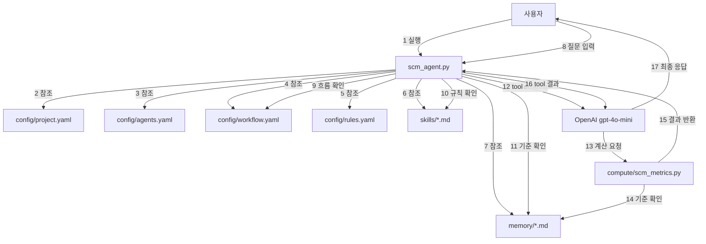

# SCM Agent Flowchart

```mermaid
flowchart TD
    U[사용자]
    A[scm_agent.py]
    P[config/project.yaml]
    AG[config/agents.yaml]
    W[config/workflow.yaml]
    R[config/rules.yaml]
    K[skills/*.md]
    M[memory/*.md]
    C[compute/scm_metrics.py]
    L[OpenAI gpt-4o-mini]

    U -- 1 실행 --> A
    A -- 2 참조 --> P
    A -- 3 참조 --> AG
    A -- 4 참조 --> W
    A -- 5 참조 --> R
    A -- 6 참조 --> K
    A -- 7 참조 --> M

    U -- 8 질문 입력 --> A
    A -- 9 흐름 확인 --> W
    A -- 10 규칙 확인 --> K
    A -- 11 기준 확인 --> M
    A -- 12 tool schema --> L
    L -- 13 계산 요청 --> C
    C -- 14 기준 확인 --> M
    C -- 15 결과 반환 --> A
    A -- 16 tool 결과 --> L
    L -- 17 최종 응답 --> U
```

